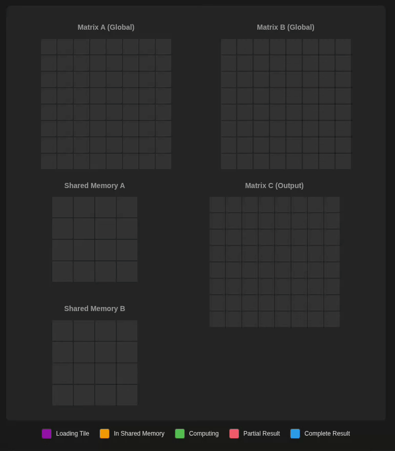
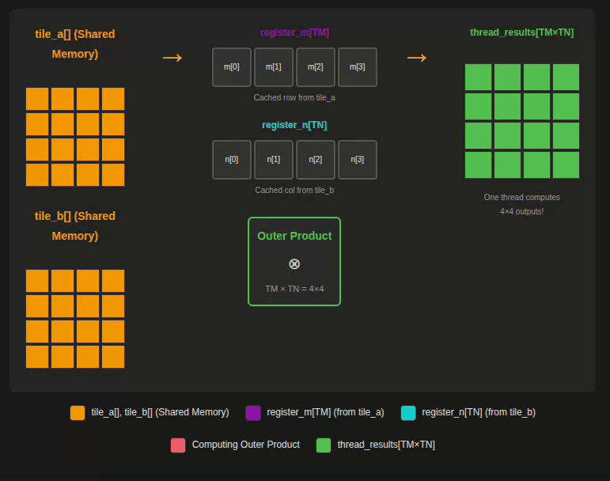

# [Learning CUTLASS the hard way](https://www.kapilsharma.dev/posts/learn-cutlass-the-hard-way/) Code

CUDA implementations of General Matrix Multiply (GEMM) operations with PyTorch integration.

## Setup

To set up the project with libtorch and CUTLASS, run:

```bash
./setup.sh
```

This will download and configure the following:
- **libtorch** (PyTorch 2.7.1 with CUDA 12.8 by default) in `third-party/libtorch`
- **CUTLASS** (version 4.3.0 by default) in `third-party/cutlass`
- **Catch2** test framework in `third-party/catch.hpp`
- **Python virtual environment** with PyTorch, loguru, pandas, plotly, and pytest in `venv/`

### Custom Versions

You can specify different PyTorch, CUDA, and CUTLASS versions:

```bash
# Use specific versions
./setup.sh -p 2.5.1 -c 121        # PyTorch 2.5.1 with CUDA 12.1
./setup.sh --pytorch 2.4.0 --cuda 118  # PyTorch 2.4.0 with CUDA 11.8

# Specify CUTLASS version
./setup.sh -t 4.2.0              # CUTLASS 4.2.0
./setup.sh --cutlass 4.5.0       # CUTLASS 4.5.0

# Remote setup (installs pip and venv from apt)
./setup.sh --remote              # For remote servers without pip/venv

# Combine all options
./setup.sh -p 2.5.1 -c 121 -t 4.2.0 --remote

# See all options
./setup.sh --help
```

**Notes:**
- The setup script will automatically install `unzip` if it's not already available on your system
- Use `--remote` flag on remote servers to automatically install `pip` and `venv` via apt
- After setup, activate the Python environment with: `source venv/bin/activate`

## CUDA Kernels

This repository contains 14 GEMM (General Matrix Multiply) kernel implementations, progressing from naive to optimized CUTLASS:

### FP32 Kernels (Single-Precision)

1. **Naive GEMM** ([cuda/01_naive.cu](cuda/01_naive.cu))
   Basic implementation with one thread per output element

2. **Global Memory Coalescing** ([cuda/02_kernel_global_mem_coalesce.cu](cuda/02_kernel_global_mem_coalesce.cu))
   Optimized thread-to-memory mapping for coalesced global memory access

3. **Shared Memory Tiling** ([cuda/03_kernel_shared_mem.cu](cuda/03_kernel_shared_mem.cu))
   Block-level tiling using shared memory to reduce global memory accesses



4. **1D Block Tiling** ([cuda/04_kernel_blocktiling_1d.cu](cuda/04_kernel_blocktiling_1d.cu))
   Enhanced block tiling with 1D thread-level tiling (TM) for increased work per thread

5. **2D Block Tiling** ([cuda/05_kernel_blocktiling_2d.cu](cuda/05_kernel_blocktiling_2d.cu))
   Full 2D thread-level tiling (TM x TN) with register blocking



6. **Vectorized Memory Access** ([cuda/06_kernel_vectorize.cu](cuda/06_kernel_vectorize.cu))
   Uses float4 vectorized loads/stores for improved memory bandwidth utilization

7. **Warp Tiling (FP32)** ([cuda/07_kernel_warptiling.cu](cuda/07_kernel_warptiling.cu))
   Warp-level tiling hierarchy: Block → Warp → Warp Subtile → Thread tiles

### Mixed Precision Kernels (FP16/BF16/FP32)

8. **Warp Tiling (All Dtypes)** ([cuda/08_kernel_warptiling_all_dtypes.cu](cuda/08_kernel_warptiling_all_dtypes.cu))
   Extended warp tiling kernel with support for FP16, BF16, and FP32 inputs

### Tensor Core Kernels (FP16/BF16 inputs, FP32 accumulation)

9. **Tensor Core Naive** ([cuda/09_kernel_tensorcore_naive.cu](cuda/09_kernel_tensorcore_naive.cu))
   Basic Tensor Core implementation using WMMA API (16x16x16 tiles)

10. **Tensor Core Warp-Tiled** ([cuda/10_kernel_tensorcore_warptiled.cu](cuda/10_kernel_tensorcore_warptiled.cu))
    Warp-level tiling with Tensor Cores for improved occupancy and performance

11. **Tensor Core Double-Buffered** ([cuda/11_kernel_tensorcore_double_buffered.cu](cuda/11_kernel_tensorcore_double_buffered.cu))
    Double buffering technique to overlap memory transfers with computation

12. **Tensor Core Async Pipeline** ([cuda/12_kernel_tensorcore_async.cu](cuda/12_kernel_tensorcore_async.cu))
    Hardware async memory copy (cp.async) with 2-stage pipeline (requires SM 8.0+)

### CUTLASS Library Kernels

13. **CUTLASS GEMM** ([cuda/13_kernel_cutlass.cu](cuda/13_kernel_cutlass.cu))
    NVIDIA CUTLASS library implementation with FP32, FP16, and BF16 support

14. **CUTLASS Autotunable** ([cuda/14_kernel_cutlass_autotunable.cu](cuda/14_kernel_cutlass_autotunable.cu))
    Multiple CUTLASS configurations for autotuning different tile sizes and stages

All kernels include PyTorch tensor wrappers for easy integration. See [cuda/gemm_kernels.cuh](cuda/gemm_kernels.cuh) for the API.

## Building

Build the project with CMake:

```bash
# Configure build (automatically detects CUDA architecture)
cmake -B build

# Or specify CUDA architecture explicitly
cmake -B build -DCMAKE_CUDA_ARCHITECTURES=89

# Build all targets
cmake --build build

# Build specific test executable
cmake --build build --target test_gemm_tensorcore
```

## Testing

### Running C++ Tests

Run all tests with CTest:

```bash
# Run all tests
ctest --test-dir build

# Run tests with verbose output
ctest --test-dir build --verbose

# Run specific test
ctest --test-dir build -R test_gemm_naive
```

Or run test executables directly:

```bash
# Run specific kernel tests
./build/test_gemm_naive
./build/test_gemm_coalesce
./build/test_gemm_shared_mem
./build/test_gemm_blocktiling1d
./build/test_gemm_blocktiling2d
./build/test_gemm_vectorize
./build/test_gemm_warptiling
./build/test_gemm_warptiling_all_dtypes
./build/test_gemm_tensorcore_naive
./build/test_gemm_tensorcore
./build/test_gemm_tensorcore_double_buffered
./build/test_gemm_tensorcore_async
./build/test_gemm_cutlass
```

### Running Python Tests

Run Python unit tests with pytest:

```bash
cd cuda/py

# Run all tests
pytest test_kernels.py -v

# Run specific test
pytest test_kernels.py::test_fp32_kernels -v

# Run tests for specific matrix size
pytest test_kernels.py -v -k "size512"
```

## Benchmarking

Benchmark kernels against PyTorch using the Python benchmark script:

```bash
cd cuda/py

# Benchmark all FP32 kernels (default)
python benchmark.py

# Benchmark all FP16-compatible kernels
python benchmark.py -d float16

# Benchmark all BF16-compatible kernels
python benchmark.py -d bfloat16

# Benchmark specific kernels with FP32
python benchmark.py -k pytorch -k naive -k tensorcore_async_fp16

# Benchmark specific kernels with FP16
python benchmark.py -d float16 -k pytorch -k warptiling -k tensorcore_fp16
```

**Available kernel names for benchmarking:**
- All dtypes: `pytorch`, `warptiling`
- FP32 only: `naive`, `global_mem_coalesce`, `shared_mem`, `blocktiling_1d`, `blocktiling_2d`, `vectorize`, `cutlass_fp32`
- FP16/BF16 only: `tensorcore_fp16`, `tensorcore_bf16`, `tensorcore_db_fp16`, `tensorcore_db_bf16`, `tensorcore_async_fp16`, `tensorcore_async_bf16`, `cutlass_fp16`, `cutlass_bf16`

The benchmark script generates interactive HTML plots showing performance comparisons across different matrix sizes.

## Autotuning

Autotune CUTLASS kernel configurations to find optimal settings for different matrix sizes:

```bash
cd cuda/py

# Autotune FP16 kernels for all power-of-2 sizes from 64 to 8192
python autotune_cutlass.py -d float16

# Autotune BF16 kernels
python autotune_cutlass.py -d bfloat16

# Autotune specific matrix sizes
python autotune_cutlass.py -d float16 --sizes 128 256 512 1024

# Load and use cached autotuning results
python autotune_cutlass.py -d float16 --load-cache --size 1024
```

The autotuner tests all available CUTLASS configurations (different tile sizes, warp configurations, and pipeline stages) and caches the best configuration for each matrix size. Results are saved as JSON files for future use.

